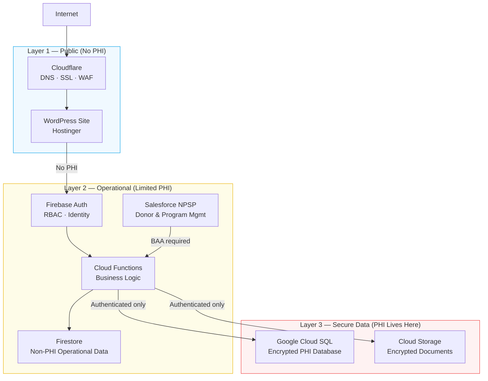

# HIPAA-Compliant Architecture for Nonprofits on Firebase & GCP

A practical reference for building HIPAA-compliant systems on Firebase and Google Cloud Platform — written for nonprofits, solo consultants, and small technical teams who can't afford a dedicated security architect.

**The gap this fills:** AWS and GCP publish HIPAA compliance docs for enterprise teams. They assume you have a solutions architect, a legal team, and a six-figure cloud budget. They don't cover what it actually looks like to build a compliant system on Firebase when your organization has 12 staff, a $60K tech budget, and a mix of Hostinger, Firebase, Cloudflare, and Salesforce in play.

This repo is built from a real implementation: a HIPAA-compliant 3-layer cloud system for a 501(c)(3) nonprofit handling PHI across 10 operational programs.

---

## Who This Is For

- **Nonprofit technology directors** evaluating Firebase/GCP for programs that handle health data, criminal justice records, or other PHI
- **Consultants and freelancers** advising organizations on HIPAA-compliant cloud architecture
- **Developers** building on Firebase who need to understand what HIPAA compliance actually requires in code and configuration — not just checkboxes
- **Grant writers and funders** who need to assess whether a proposed technology system is genuinely HIPAA-ready

---

## The Core Architecture

A 3-layer model that isolates PHI behind application logic, keeping each layer's compliance scope clean:

**The rule:** PHI never touches Layer 1. Layer 2 handles identity and business logic. Layer 3 stores PHI and is never directly accessible from the client.

---

## What's in This Repo

| Document | What It Covers |
|---|---|
| [HIPAA Fundamentals](docs/01-hipaa-fundamentals.md) | What HIPAA actually requires technically — no fluff |
| [Three-Layer Architecture](docs/02-three-layer-architecture.md) | Full architecture breakdown with diagrams |
| [Firebase HIPAA Guide](docs/03-firebase-hipaa-guide.md) | What's covered under the BAA, what isn't, and the critical gotchas |
| [Multi-Vendor Boundaries](docs/04-multi-vendor-boundaries.md) | Where compliance responsibility shifts across Hostinger, Firebase, Cloudflare, Salesforce |
| [RBAC Design](docs/05-rbac-design.md) | Role-based access control across staff, volunteers, and clients |
| [Data Classification](docs/06-data-classification.md) | What counts as PHI, how to tag and isolate it |
| [Nonprofit Cost Guide](docs/07-nonprofit-cost-guide.md) | Real cost estimates for Firebase/GCP at nonprofit scale |

| Checklist | What It Covers |
|---|---|
| [Firebase Configuration](checklists/firebase-configuration.md) | Every Firebase security setting to verify |
| [GCP Configuration](checklists/gcp-configuration.md) | Cloud SQL, IAM, audit logging, VPC setup |
| [Pre-Launch HIPAA Audit](checklists/pre-launch-audit.md) | The full checklist before go-live |

| Case Study | What It Covers |
|---|---|
| [Three-Layer Nonprofit Build](case-studies/three-layer-nonprofit-build.md) | End-to-end build walkthrough based on a real 501(c)(3) implementation |

---

## The Most Important Thing Nobody Tells You

**Firebase Realtime Database is NOT covered under Google's BAA.**

If your app stores PHI and you're using Firebase Realtime Database — not Firestore — you are out of compliance. Full stop. Firestore is covered. Realtime Database is not. This distinction is buried in Google's BAA documentation and catches teams off guard constantly.

[Full breakdown →](docs/03-firebase-hipaa-guide.md#what-is-and-isnt-covered)

---

## Quick Reference: BAA Status by Service

| Service | BAA Covered | PHI Allowed | Notes |
|---|---|---|---|
| **Firestore** | ✅ Yes | ✅ Yes | Must enable audit logging |
| **Firebase Auth** | ✅ Yes | ⚠️ Limited | No clinical data in user profiles |
| **Cloud Functions** | ✅ Yes | ✅ Yes | Don't log PHI; use VPC for SQL |
| **Cloud SQL** | ✅ Yes | ✅ Yes | Enable CMEK, private IP only |
| **Cloud Storage** | ✅ Yes | ✅ Yes | Enable uniform bucket-level access |
| **Firebase Realtime DB** | ❌ No | ❌ No | Use Firestore instead |
| **Firebase Hosting** | ❌ No | ❌ No | Public layer only |
| **Firebase Analytics** | ❌ No | ❌ No | Never pass PHI through events |
| **Crashlytics** | ❌ No | ❌ No | Sanitize crash reports |
| **Cloudflare (Business+)** | ⚠️ BAA available | ⚠️ Transit only | PHI in transit, not at rest |
| **Salesforce (w/ BAA)** | ⚠️ Tier-dependent | ⚠️ Tier-dependent | Verify your edition covers HIPAA |
| **Stripe** | ❌ No BAA | ❌ No | PCI only; keep PHI completely separate |
| **Hostinger** | ❌ No BAA | ❌ No | Public layer only |

---

## Getting Started

If you're building from scratch, read in this order:

1. [HIPAA Fundamentals](docs/01-hipaa-fundamentals.md) — understand what you're actually required to do
2. [Three-Layer Architecture](docs/02-three-layer-architecture.md) — pick your pattern
3. [Firebase HIPAA Guide](docs/03-firebase-hipaa-guide.md) — configure Firebase correctly
4. [Multi-Vendor Boundaries](docs/04-multi-vendor-boundaries.md) — map your BAA coverage
5. [RBAC Design](docs/05-rbac-design.md) — design your access control model
6. [Pre-Launch Audit Checklist](checklists/pre-launch-audit.md) — verify before go-live

---

## About

Built from a real implementation. This is a complete overview of the HIPAA-compliant 3-layer cloud infrastructure for a faith-based 501(c)(3) nonprofit handling PHI across 10 integrated service programs, designed to support 100–150 residents.

**Damarius McNair** — Product Manager & Technology Strategist

- Portfolio: [dcodebase-x.github.io](https://dcodebase-x.github.io)
- GitHub: [@DCodeBase-X](https://github.com/DCodeBase-X)
- LinkedIn: [linkedin.com/in/damariusmcnair](https://linkedin.com/in/damariusmcnair)

---

> **Disclaimer:** This is a technical reference guide, not legal advice. HIPAA compliance is a legal obligation — engage qualified legal counsel for your specific situation. This guide addresses technical and architectural implementation only.
