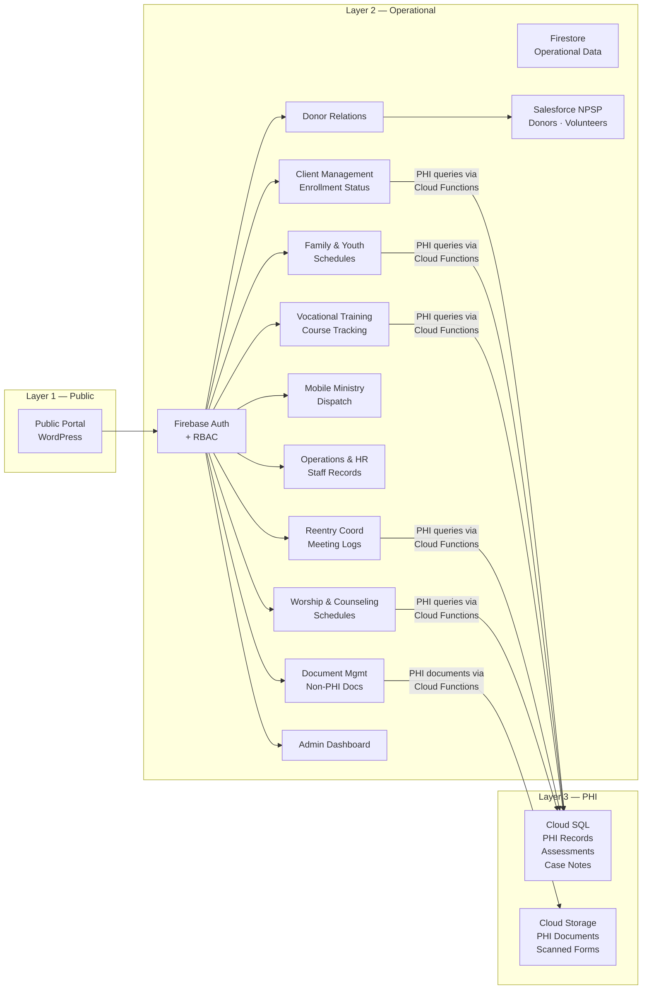
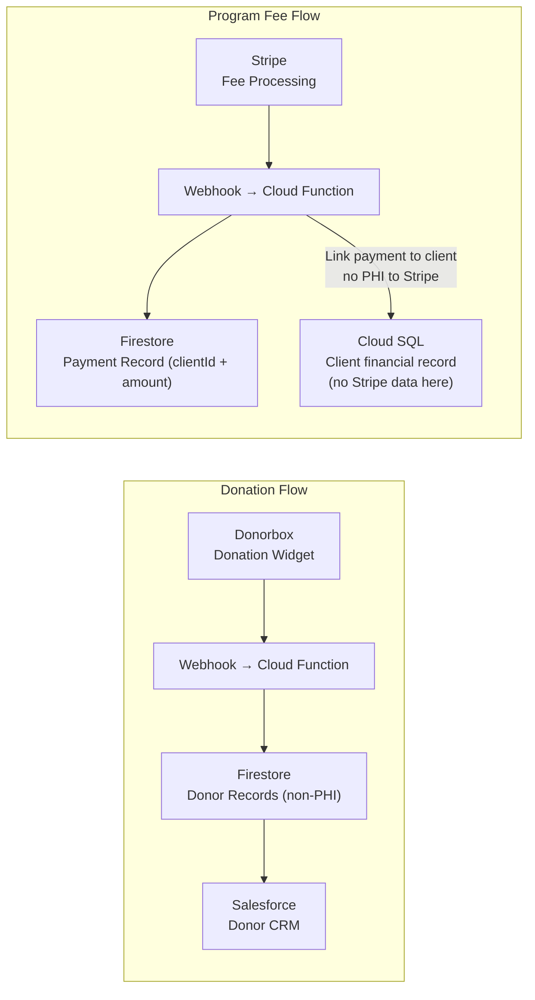

# Case Study: Three-Layer HIPAA-Compliant Build for a Faith-Based Nonprofit

**Organization type:** 501(c)(3) faith-based reentry and social services nonprofit
**Location:** New York (incorporated) → Raleigh-Durham, NC (primary operations)
**Programs:** 10 integrated service areas including transitional housing, reentry coordination, vocational training, family services, and mobile ministry
**Projected capacity:** 100–150 residents

This case study walks through the end-to-end architectural decisions made for a real nonprofit implementation — from the initial technology assessment through final system design. Organization and individual details have been generalized.

---

## The Starting Point

The organization had no existing technology infrastructure. Zero. A Google Workspace account, a domain name, and an ambitious vision for a multi-program residential facility. The technology brief was essentially: "We need everything."

The complicating factors:
- Programs would handle PHI across health, criminal justice, and children's services — three distinct sensitivity categories
- The organization had no in-house technical staff and no budget for a dedicated IT role
- They needed to be fundable — meaning the technology documentation had to satisfy potential institutional funders and government partners
- Total technology budget for year one: under $75,000 including all infrastructure, licensing, and professional services
- Timeline: documentation and architecture ready for funder presentation within 90 days

---

## Technology Assessment

The first step was a requirements analysis across all 10 program areas. Key findings:

**PHI sources identified:**
- Client intake forms (health history, mental health assessments, substance use)
- Criminal justice records (parole conditions, conviction history)
- Children's data (for clients with minor dependents)
- Vocational training assessments tied to individual client files
- Case management notes across all programs
- Medical and counseling appointment records

**Data volume estimate:** 100–150 active clients × ~40 data points per client across programs = modest database requirements. No need for enterprise-scale infrastructure.

**Compliance requirements:**
- HIPAA (health data, mental health, substance use)
- FERPA considerations for any education-related records
- NC state requirements for residential facility licensing

**Staff access model:**
- ~12 staff at launch, growing to 30+
- 3–4 roles with PHI access, 3–4 roles without
- Client self-service portal required for certain programs
- Volunteer portal needed (no PHI access)

---

## Architecture Decision: Why Three Layers

The three-layer model was chosen over alternatives for specific reasons:

**Option A: Single-platform (Salesforce Health Cloud)**
Rejected. Cost prohibitive at ~$150+/user/month for HIPAA-capable tier. Would consume the entire technology budget before any infrastructure was built.

**Option B: Firebase-only**
Rejected. Firebase Realtime Database is not BAA-covered. Firestore is, but using Firestore as the sole PHI store would mean more complex security rules and less mature query capability for structured PHI data. Cloud SQL is better suited for relational health records.

**Option C: Three-layer (chosen)**
- Layer 1 (WordPress/Hostinger): Needed anyway for public website. Cheap, flexible, familiar to non-technical staff.
- Layer 2 (Firebase/Salesforce): Firebase Auth for RBAC is excellent. Salesforce NPSP is free for nonprofits and handles donor/volunteer/program data well.
- Layer 3 (Cloud SQL + Cloud Storage): Right tool for structured PHI — relational, auditable, CMEK-capable, BAA-covered.

---

## The 10-System Architecture

Each of the 10 operational areas was mapped to the three-layer model:



**Which systems touch PHI (Cloud SQL):**
- Client Management — intake records, assessments, health history
- Family & Youth Services — children's records, family health data
- Vocational Training — individualized training plans with assessment data
- Reentry Coordination — criminal justice records, parole conditions
- Worship & Counseling — counseling session notes, referrals

**Which systems stay in Firestore (no PHI):**
- Mobile Ministry Dispatch — scheduling and location data only
- Operations & HR — staff employment records (no client PHI)
- Donor Relations — donor data routed to Salesforce
- Document Management — policy documents, templates, non-PHI files
- Admin Dashboard — aggregate metrics, no individual PHI

---

## Cloud SQL Schema Design

The PHI database was structured with a clear separation between client identity and clinical data — a deliberate design choice to limit PHI exposure in any single query.

```
clients              (id, created_at, assigned_staff_id, program_id, status)
client_identifiers   (client_id, first_name, last_name, dob, ssn_last4, address)
health_records       (client_id, recorded_by, recorded_at, field_name, field_value)
assessments          (client_id, assessment_type, score, administered_by, date)
case_notes           (client_id, author_id, content, created_at, is_sensitive)
criminal_records     (client_id, offense_type, jurisdiction, conditions, status)
documents            (client_id, document_type, storage_path, uploaded_by, uploaded_at)
```

`health_records` uses an entity-attribute-value (EAV) pattern — `field_name` and `field_value` — so new PHI fields can be added without schema migrations. This also makes it straightforward to query only the fields a specific staff role is authorized to see.

---

## RBAC Implementation

Five roles were defined based on the program staff structure:

| Role | PHI Access | Firestore Access | Salesforce |
|---|---|---|---|
| `admin` | All records | All collections | Full |
| `clinical_staff` | Assigned clients only | Assigned program data | None |
| `program_staff` | None | Program-relevant data | Limited |
| `volunteer` | None | Volunteer portal only | None |
| `client` | Own records only | Own portal data | None |

Clinical staff are assigned client lists stored in their Firebase Auth custom claims. Every Cloud Function that touches PHI validates this assignment before executing.

---

## Payment Integration Architecture

The organization needed two revenue streams: donations and program fees. Both were handled with a strict PHI boundary:



The critical design decision: Stripe receives `clientId` (a UUID) and payment amount — never the client's name, health status, or any PHI. The link between a payment and a client record lives only in Cloud SQL, accessible only through authenticated Cloud Functions.

---

## Infrastructure Cost (Year 1)

Based on the architecture above, annual infrastructure costs:

| Item | Annual Cost |
|---|---|
| Firebase/GCP (Blaze plan, estimated usage) | $1,200–$2,400 |
| Google for Nonprofits credit (offset) | −$20,000 (applied) |
| Salesforce NPSP (Power of Us grant) | $0 |
| Hostinger WordPress hosting | $200–$360 |
| Cloudflare Pro | $240 |
| Google Workspace (12 users @ $12/user/mo) | $1,440 |
| Domain registrations | $50 |
| **Net annual infrastructure** | **~$1,200–$2,700** |

The Google for Nonprofits credits covered all GCP/Firebase costs for year one and most of year two at projected usage. The effective out-of-pocket cost for the cloud infrastructure was near zero.

---

## Documentation Deliverables

The architecture work produced the following documentation, which was included in the funder readiness package:

- System architecture diagrams (this reference guide's diagrams, adapted)
- Data flow documentation for each of the 10 program systems
- HIPAA risk analysis and safeguard documentation
- Role-based access control matrix
- BAA inventory and status
- Technology stack decision rationale
- 5-phase implementation timeline
- Total cost of ownership projections

This documentation package was specifically cited as a differentiator in funder conversations — it demonstrated operational readiness and governance maturity that most early-stage nonprofits cannot show.

---

## Lessons Learned

**What worked:**
- The three-layer separation made the compliance story clean and auditable
- Cloud SQL for PHI with Firestore for operational data is the right split — don't try to do everything in one database
- Firebase Auth custom claims for RBAC are underrated — they're simple, scalable, and directly usable in Firestore Security Rules
- Google for Nonprofits credits are genuinely significant — apply on day one

**What would change:**
- Start with Cloud SQL HA from the beginning rather than planning to enable it later — the migration is disruptive
- Build the audit logging Cloud Function before the first PHI-touching feature, not after
- Document the Firestore schema formally before any data is written to it — retroactive schema documentation is painful

**The hardest part:**
Not the technology — the organizational change management. Getting staff comfortable with role-based access controls when they're used to spreadsheets requires clear communication about why it matters. The "why HIPAA" conversation needs to happen before the system is built, not when they first hit a permission denied error.

---

*This case study is based on a real implementation. Organization details are generalized for privacy.*

*Built by **Damarius McNair** — [Portfolio](https://dcodebase-x.github.io) · [GitHub](https://github.com/DCodeBase-X)*
