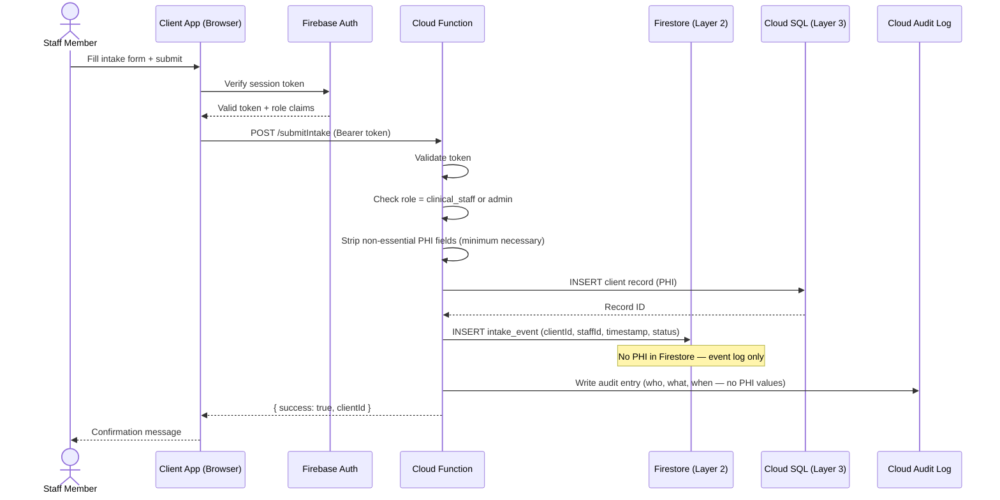

# Three-Layer Architecture

The core pattern for HIPAA-compliant systems on Firebase/GCP is a strict three-layer model. Each layer has a defined compliance scope, and the rule is enforced at the network and application level — not just policy.

---

## The Model

```mermaid
flowchart TD
    USER(("User / Browser"))

    subgraph L1["Layer 1 — Public\n No PHI · No BAA Required"]
        CF["Cloudflare\nDNS · WAF · SSL Termination"]
        WP["WordPress / Hostinger\nPublic Site"]
    end

    subgraph L2["Layer 2 — Operational\nLimited PHI · BAA Required"]
        direction TB
        FA["Firebase Auth\nIdentity · RBAC · MFA"]
        FF["Cloud Functions\nBusiness Logic\n(only layer that touches Layer 3)"]
        FS["Firestore\nNon-PHI Operational Data\nSchedules · Tasks · Logs"]
        SF["Salesforce NPSP\nDonors · Volunteers · Enrollment"]
    end

    subgraph L3["Layer 3 — Secure Data\nPHI Lives Here · BAA Required"]
        SQL["Google Cloud SQL\nEncrypted PHI\nPrivate IP Only"]
        GCS["Cloud Storage\nEncrypted PHI Documents\nUniform Access Control"]
    end

    USER --> CF
    CF -- "Public content only" --> WP
    CF -- "Auth requests" --> FA

    FA -- "Authenticated sessions" --> FF
    FF --> FS
    FF --> SF
    FF -- "VPC Connector\nPrivate network only" --> SQL
    FF -- "Service account auth" --> GCS

    WP -- "No direct DB access" --> x1[" "]
    style x1 display:none

    style L1 fill:#eff6ff,stroke:#3b82f6,color:#1e3a5f
    style L2 fill:#fefce8,stroke:#ca8a04,color:#713f12
    style L3 fill:#fef2f2,stroke:#dc2626,color:#7f1d1d
```

---

## Layer 1 — Public Layer

**Purpose:** Public-facing content. No authentication, no PHI, no BAA required.

**Components:**
- **Cloudflare** — DNS management, SSL termination, WAF, DDoS protection, HSTS
- **WordPress on Hostinger** — Organization website, public program information, general contact forms, donation landing pages

**Rules:**
- No PHI of any kind enters this layer
- Contact forms collect name/email/phone only — never health information
- Donation processing routes to Stripe/Donorbox — neither has PHI
- No database connection to Layer 2 or Layer 3 exists from this layer
- Authentication happens at Layer 2 (Firebase Auth) — WordPress does not authenticate PHI users

**Why this layer exists:** Most nonprofits need a public website. Keeping it completely separate from the operational system means a WordPress vulnerability (which are extremely common) cannot expose PHI.

---

## Layer 2 — Operational Layer

**Purpose:** Identity, business logic, and non-PHI operational data. This is where staff work day-to-day.

**Components:**
- **Firebase Auth** — Staff, volunteer, and client portal authentication. Role-based custom claims. MFA enforcement for clinical roles.
- **Cloud Functions** — All application business logic. The only component permitted to query Layer 3. Acts as a controlled API gateway between the client app and PHI storage.
- **Firestore** — Non-PHI operational data: schedules, task assignments, volunteer coordination, program enrollment status (without clinical details), notifications, audit event records.
- **Salesforce NPSP** — Donor management, volunteer records, grant tracking, organizational reporting — none of which contain clinical PHI.

**Rules:**
- Cloud Functions are the only path to Layer 3 — no direct client-to-database connections
- Firestore stores non-PHI data only — client IDs and program enrollment flags are acceptable; diagnoses and assessments are not
- PHI is never logged in Cloud Functions logs
- All Cloud Functions validate authentication and role before executing

**Why Cloud Functions as the gateway:**
Direct Firestore client SDK access is fine for non-PHI data, but PHI in Cloud SQL should never be reachable from a client app. Cloud Functions sit in the middle, validate identity and permissions server-side, and return only the minimum necessary data. This also means your security logic lives in one place rather than scattered across client apps.

---

## Layer 3 — Secure Data Layer

**Purpose:** PHI storage. Designed to be inaccessible except through authenticated, authorized Cloud Functions.

**Components:**
- **Google Cloud SQL (PostgreSQL or MySQL)** — Primary PHI database. Private IP only, no public endpoint. Encrypted at rest with CMEK (Customer-Managed Encryption Keys). Automatic backups. Audit logging.
- **Cloud Storage** — PHI documents: intake forms, assessments, legal documents, clinical notes as files. Uniform bucket-level access control. No public buckets. Object versioning enabled.

**Rules:**
- No public IP on Cloud SQL — accessible only via VPC connector from Cloud Functions
- All data encrypted at rest (Google-managed or CMEK)
- All data encrypted in transit (TLS 1.2+, enforced at instance level)
- Cloud SQL Proxy or VPC used for all connections — never raw TCP from public network
- Cloud Storage buckets: uniform access, no public objects, versioning enabled, lifecycle policies for retention
- Audit logging enabled for all read/write operations

---

## Data Flow: Client Intake (Example)

A staff member submits a new client intake form containing PHI. Here's the complete path:



PHI enters Cloud SQL. A non-PHI event record goes to Firestore. The audit log records the operation. The staff member's app never holds PHI beyond the form session.

---

## Scaling This Architecture

This model scales from a 10-person nonprofit to a 500-person organization without architectural changes:

| Scale | Adjustment |
|---|---|
| **Early stage (10 staff)** | Firebase Spark → Blaze, single Cloud SQL instance (db-f1-micro ~$10/mo) |
| **Growing (50 staff)** | Upgrade Cloud SQL tier, add read replicas, add Cloud CDN for static assets |
| **Established (200+ staff)** | Cloud SQL High Availability, multi-region Firestore, dedicated VPC, Cloud Armor |
| **Multi-location** | Regional Cloud SQL instances, Cloud Spanner consideration, Firebase multi-region |

The compliance requirements don't change with scale — the infrastructure to meet them gets more robust.

---

**Next:** [Firebase HIPAA Guide →](03-firebase-hipaa-guide.md)
