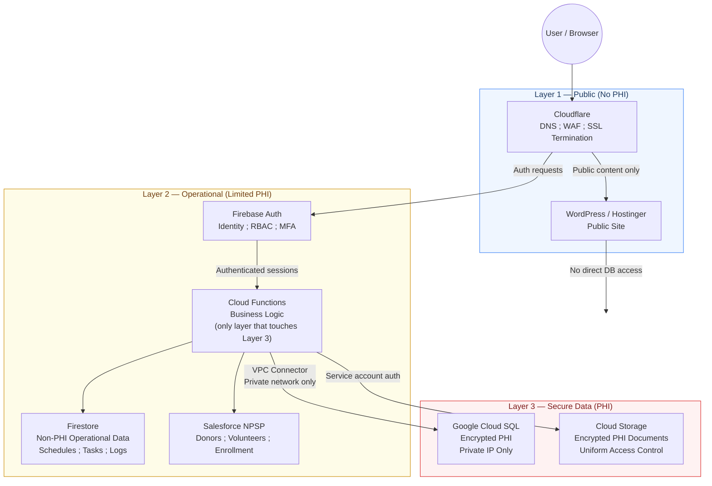
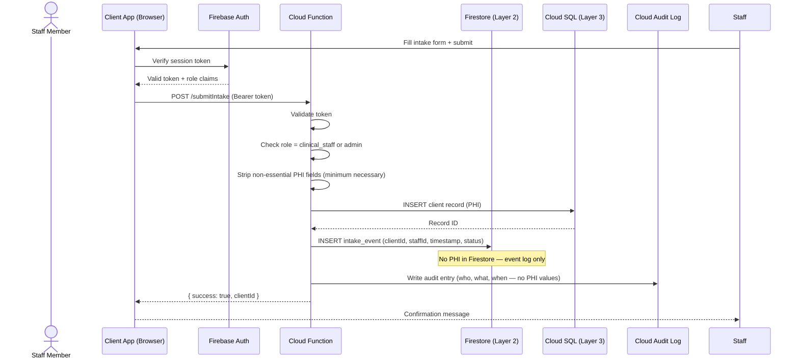

# Three-Layer Architecture

The core pattern for HIPAA-compliant systems on Firebase/GCP is a strict three-layer model. Each layer has a defined compliance scope, enforced at the network and application level — not just policy.

## Quick Reference

| Layer | Name | PHI | BAA Required | Key Components |
| --- | --- | :---: | :---: | --- |
| **L1** | Public | ❌ | ❌ | Cloudflare, WordPress |
| **L2** | Operational | Limited | ✅ | Firebase Auth, Cloud Functions, Firestore, Salesforce |
| **L3** | Secure Data | ✅ | ✅ | Cloud SQL, Cloud Storage |

---

## Architecture Diagram

```mermaid
flowchart TD
    USER(("User / Browser"))

    subgraph L1["Layer 1 — Public (No PHI)"]
        CF["Cloudflare<br/>DNS ; WAF ; SSL Termination"]
        WP["WordPress / Hostinger<br/>Public Site"]
    end

    subgraph L2["Layer 2 — Operational (Limited PHI)"]
        direction TB
        FA["Firebase Auth<br/>Identity ; RBAC ; MFA"]
        FF["Cloud Functions<br/>Business Logic<br/>(only layer that touches Layer 3)"]
        FS["Firestore<br/>Non-PHI Operational Data<br/>Schedules ; Tasks ; Logs"]
        SF["Salesforce NPSP<br/>Donors ; Volunteers ; Enrollment"]
    end

    subgraph L3["Layer 3 — Secure Data (PHI)"]
        SQL["Google Cloud SQL<br/>Encrypted PHI<br/>Private IP Only"]
        GCS["Cloud Storage<br/>Encrypted PHI Documents<br/>Uniform Access Control"]
    end

    USER --> CF
    CF -- "Public content only" --> WP
    CF -- "Auth requests" --> FA

    FA -- "Authenticated sessions" --> FF
    FF --> FS
    FF --> SF
    FF -- "VPC Connector<br/>Private network only" --> SQL
    FF -- "Service account auth" --> GCS

    WP -- "No direct DB access" --> x1[" "]
    style x1 fill:none,stroke:none,color:none

    style L1 fill:#eff6ff,stroke:#3b82f6,color:#1e3a5f
    style L2 fill:#fefce8,stroke:#ca8a04,color:#713f12
    style L3 fill:#fef2f2,stroke:#dc2626,color:#7f1d1d
```

---

## Layer 1 — Public Layer

**Purpose:** Public-facing content. No authentication, no PHI, no BAA required.

**Components:**

| Component | Role |
| --- | --- |
| **Cloudflare** | DNS, SSL termination, WAF, DDoS protection, HSTS |
| **WordPress on Hostinger** | Organization website, public program info, contact forms, donation landing pages |

**Rules:**

- No PHI of any kind enters this layer
- Contact forms collect name/email/phone only — never health information
- Donation processing routes to Stripe/Givebutter, neither of which holds PHI
- No database connection to Layer 2 or Layer 3 exists from this layer
- Authentication happens at Layer 2 (Firebase Auth) — WordPress does not authenticate PHI users

> **Why this layer exists:** Most nonprofits need a public website. Keeping it completely isolated from the operational system means a WordPress vulnerability — which are extremely common — cannot expose PHI.

---

## Layer 2 — Operational Layer

**Purpose:** Identity, business logic, and non-PHI operational data. This is where staff work day-to-day.

**Components:**

| Component | Role |
| --- | --- |
| **Firebase Auth** | Staff, volunteer, and client portal authentication; role-based custom claims; MFA for clinical roles |
| **Cloud Functions** | All business logic; the only component permitted to query Layer 3; acts as a controlled API gateway |
| **Firestore** | Non-PHI operational data: schedules, task assignments, volunteer coordination, enrollment status, audit events |
| **Salesforce NPSP** | Donor management, volunteer records, grant tracking, org reporting — no clinical PHI |

**Rules:**

- Cloud Functions are the only path to Layer 3 — no direct client-to-database connections
- Firestore stores non-PHI only: client IDs and enrollment flags are acceptable; diagnoses and assessments are not
- PHI is never written to Cloud Functions logs
- All Cloud Functions validate authentication and role before executing

> **Why Cloud Functions as the gateway:** Direct Firestore client SDK access is fine for non-PHI data, but PHI in Cloud SQL should never be reachable from a client app. Cloud Functions sit in the middle, validate identity and permissions server-side, and return only the minimum necessary data. Security logic lives in one place rather than scattered across client apps.

---

## Layer 3 — Secure Data Layer

**Purpose:** PHI storage. Inaccessible except through authenticated, authorized Cloud Functions.

**Components:**

| Component | Role |
| --- | --- |
| **Google Cloud SQL** | Primary PHI database. Private IP only, no public endpoint. CMEK encryption at rest. Automatic backups and audit logging. |
| **Cloud Storage** | PHI documents: intake forms, assessments, legal docs, clinical notes. Uniform bucket-level access, no public buckets, versioning enabled. |

**Rules:**

- No public IP on Cloud SQL — accessible only via VPC connector from Cloud Functions
- All data encrypted at rest (Google-managed or CMEK) and in transit (TLS 1.2+)
- Cloud SQL Proxy or VPC used for all connections — never raw TCP from public network
- Cloud Storage: uniform access, no public objects, versioning enabled, lifecycle policies for retention
- Audit logging enabled for all read/write operations

---

## Data Flow: Client Intake Example

A staff member submits a new client intake form containing PHI. Here's the complete path:

```mermaid
sequenceDiagram
    actor Staff Member
    participant App as Client App (Browser)
    participant Auth as Firebase Auth
    participant CF as Cloud Function
    participant FS as Firestore (Layer 2)
    participant SQL as Cloud SQL (Layer 3)
    participant Log as Cloud Audit Log

    Staff->>App: Fill intake form + submit
    App->>Auth: Verify session token
    Auth-->>App: Valid token + role claims

    App->>CF: POST /submitIntake (Bearer token)
    CF->>CF: Validate token
    CF->>CF: Check role = clinical_staff or admin
    CF->>CF: Strip non-essential PHI fields (minimum necessary)

    CF->>SQL: INSERT client record (PHI)
    SQL-->>CF: Record ID

    CF->>FS: INSERT intake_event (clientId, staffId, timestamp, status)
    Note over FS: No PHI in Firestore — event log only

    CF->>Log: Write audit entry (who, what, when — no PHI values)
    CF-->>App: { success: true, clientId }
    App-->>Staff: Confirmation message
```

PHI enters Cloud SQL. A non-PHI event record goes to Firestore. The audit log records the operation. The staff member's app never holds PHI beyond the form session.

---

## Scaling This Architecture

This model scales from a 10-person nonprofit to a 500-person organization without architectural changes:

| Scale | Adjustment |
| --- | --- |
| **Early stage (10 staff)** | Firebase Spark → Blaze, single Cloud SQL instance (`db-f1-micro`, ~$10/mo) |
| **Growing (50 staff)** | Upgrade Cloud SQL tier, add read replicas, add Cloud CDN for static assets |
| **Established (200+ staff)** | Cloud SQL High Availability, multi-region Firestore, dedicated VPC, Cloud Armor |
| **Multi-location** | Regional Cloud SQL instances, Cloud Spanner consideration, Firebase multi-region |

The compliance requirements don't change with scale — the infrastructure to meet them gets more robust.

---

**Next:** [Firebase HIPAA Guide →](03-firebase-hipaa-guide.md)
