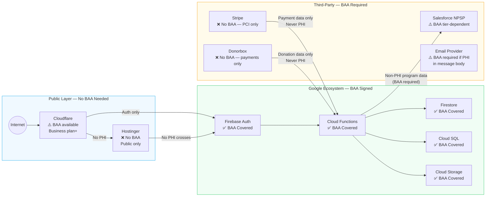
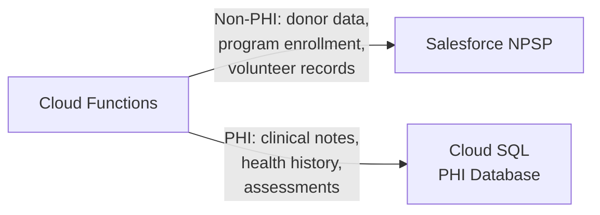

# Multi-Vendor Boundaries

Real nonprofit systems don't run on a single platform. A typical stack spans a public website host, a developer platform, a cloud database, a CRM, a payment processor, and a CDN. HIPAA compliance requires knowing exactly where PHI crosses vendor boundaries — and whether each vendor has a signed BAA.

This page maps the boundaries for a Firebase/GCP nonprofit stack.

---

## The Boundary Map

---

## Vendor-by-Vendor Breakdown

### Google Cloud / Firebase ✅
**BAA status:** Available and should be signed before any PHI is stored.
**How to sign:** Cloud Console → IAM & Admin → Settings → HIPAA BAA
**Covers:** Firestore, Cloud Functions, Cloud SQL, Cloud Storage, Firebase Auth, Pub/Sub, and others on the [eligible services list](https://cloud.google.com/security/compliance/hipaa-compliance)
**Does NOT cover:** Firebase Realtime Database, Firebase Hosting, Analytics, Crashlytics

**PHI allowed:** Yes, in covered services, after signing the BAA.

---

### Cloudflare ⚠️
**BAA status:** Available on Business and Enterprise plans only. Not available on Free or Pro.
**What Cloudflare sees:** DNS queries, HTTP headers, request metadata, and request/response content if you're not using end-to-end encryption properly.

**The nuance:** If all PHI is encrypted at the application layer before it hits Cloudflare (i.e., Cloudflare terminates TLS but your app payload is separately encrypted), some practitioners argue a BAA isn't strictly required because Cloudflare can't read the PHI. This is a legal grey area — get your counsel's opinion.

**Practical recommendation:** If you're on Cloudflare Business plan anyway for security features (WAF, bot protection, etc.), sign the BAA. If you're on Free/Pro, ensure PHI never appears in URLs, headers, or unencrypted payloads.

**Configuration requirements:**
- Enable "Always Use HTTPS"
- Set minimum TLS version to 1.2
- Enable HSTS
- Configure WAF to block common injection patterns
- Disable caching for any authenticated routes

---

### Hostinger ❌
**BAA status:** Not available.
**PHI allowed:** No.

Hostinger hosts your public-facing WordPress site. The architectural rule is simple: no PHI ever touches this layer. Contact forms on the WordPress site should not collect health information — route users to your Firebase-authenticated portal for anything involving PHI.

**What's safe on Hostinger:**
- Public program information
- General contact forms (name, email, phone — no health data)
- Donation pages (payment handled by Stripe/Donorbox)
- Blog, news, organizational information

---

### Salesforce NPSP ⚠️
**BAA status:** Tier-dependent. Salesforce will sign a BAA for certain editions.
**Which editions:** Health Cloud is explicitly HIPAA-capable. NPSP (Nonprofit Success Pack) on Enterprise and above can have a BAA — verify with your Salesforce rep before assuming.

**Common mistake:** Organizations assume all Salesforce is HIPAA-covered. It's not — your specific edition and contract matter.

**Recommended architecture:** Use Salesforce for non-PHI program management — donor relationships, volunteer coordination, program enrollment tracking (not clinical data). Route actual PHI to Cloud SQL / Firestore where your Google BAA clearly covers it. This limits your Salesforce compliance surface area.

---

### Stripe & Donorbox ❌
**BAA status:** Stripe does not sign BAAs. Donorbox does not sign BAAs.
**PHI allowed:** No — these handle payment data under PCI-DSS, not health data under HIPAA.

**The risk scenario to avoid:** A client who is also a donor. If your system ties a payment record to a client record that contains PHI, ensure the connection is one-directional and PHI never flows into Stripe or Donorbox.

**Architecture rule:** Payment processing lives in its own data silo. Stripe webhooks fire into Cloud Functions, which update payment records in a non-PHI Firestore collection. Client records in Cloud SQL are never passed to Stripe.

---

### Email Providers ⚠️
**BAA status:** Depends on provider.
- **Google Workspace:** BAA available, covers Gmail when used through your organization account
- **SendGrid:** BAA available on higher tiers
- **Mailchimp:** Does not sign BAAs for HIPAA purposes
- **Standard consumer email (Gmail free, Outlook.com):** No BAA — not for PHI

**The practical rule:** Do not send PHI in email body text. Ever. Use a secure message notification ("You have a new secure message — log in to view it") that directs the user to your authenticated portal. This sidesteps the email BAA question for most communication.

---

## The Boundary Checklist

Before go-live, answer yes to every item:

- [ ] Google BAA signed in Cloud Console
- [ ] Every vendor that touches PHI has a signed BAA on file
- [ ] PHI never appears in Hostinger/WordPress
- [ ] PHI never passes to Firebase Realtime Database
- [ ] PHI never appears in Firebase Analytics event parameters
- [ ] PHI never appears in Crashlytics reports (sanitize before reporting)
- [ ] Stripe/Donorbox integrations never receive client health data
- [ ] Cloudflare BAA signed OR all PHI payloads are separately encrypted
- [ ] Salesforce usage is limited to non-PHI data OR Salesforce BAA is signed for your edition
- [ ] PHI emails route to authenticated portal, not email body

---

**Next:** [RBAC Design →](05-rbac-design.md)
