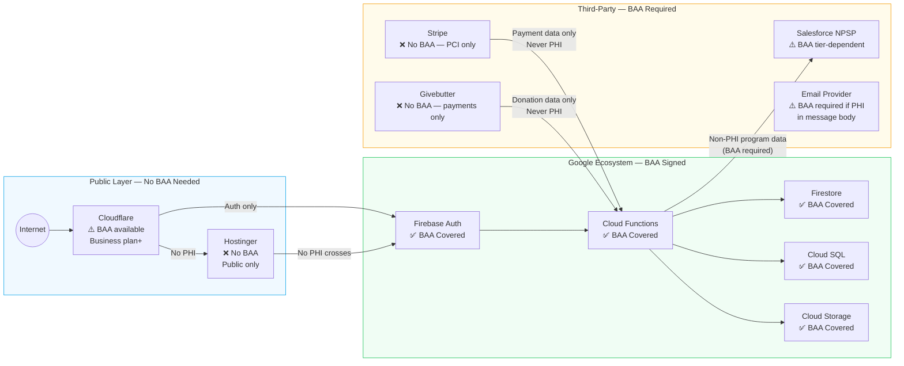
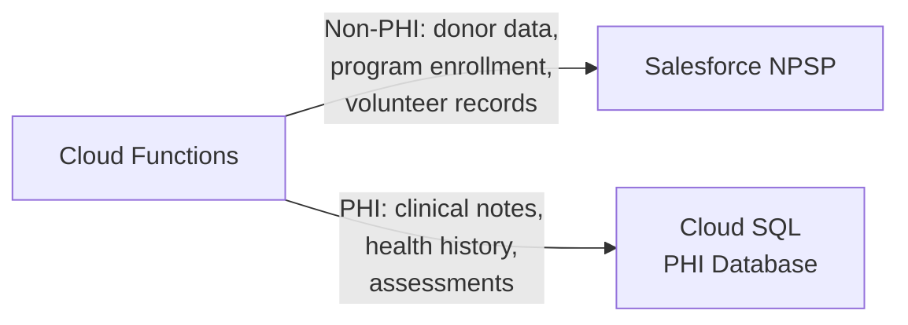

# Multi-Vendor Boundaries

Real nonprofit systems don't run on a single platform. A typical stack spans a public website host, a developer platform, a cloud database, a CRM, a payment processor, and a CDN. HIPAA compliance requires knowing exactly where PHI crosses vendor boundaries and whether each vendor has a signed BAA.

This page maps the boundaries for a Firebase/GCP nonprofit stack.

 

## The Boundary Map

```mermaid
flowchart LR
    subgraph Public["Public Layer — No BAA Needed"]
        INT(("Internet"))
        CF["Cloudflare\n⚠️ BAA available\nBusiness plan+"]
        HOST["Hostinger\n❌ No BAA\nPublic only"]
    end

    subgraph Google["Google Ecosystem — BAA Signed"]
        FA["Firebase Auth\n✅ BAA Covered"]
        FF["Cloud Functions\n✅ BAA Covered"]
        FS["Firestore\n✅ BAA Covered"]
        SQL["Cloud SQL\n✅ BAA Covered"]
        GCS["Cloud Storage\n✅ BAA Covered"]
    end

    subgraph ThirdParty["Third-Party — BAA Required"]
        SF["Salesforce NPSP\n⚠️ BAA tier-dependent"]
        STR["Stripe\n❌ No BAA — PCI only"]
        DB["Givebutter\n❌ No BAA — payments only"]
        EMAIL["Email Provider\n⚠️ BAA required if PHI\nin message body"]
    end

    INT --> CF
    CF -- "No PHI" --> HOST
    CF -- "Auth only" --> FA
    FA --> FF
    FF --> FS
    FF --> SQL
    FF --> GCS
    FF -- "Non-PHI program data\n(BAA required)" --> SF
    HOST -- "No PHI crosses" --> FA

    STR -- "Payment data only\nNever PHI" --> FF
    DB  -- "Donation data only\nNever PHI" --> FF

    style Public fill:#f0f9ff,stroke:#0ea5e9
    style Google fill:#f0fdf4,stroke:#22c55e
    style ThirdParty fill:#fffbeb,stroke:#f59e0b
```

 

## Vendor-by-Vendor Breakdown

### Google Cloud / Firebase ✅
**BAA status:** Available and should be signed before any PHI is stored.
**How to sign:** Cloud Console → IAM & Admin → Settings → HIPAA BAA
**Covers:** Firestore, Cloud Functions, Cloud SQL, Cloud Storage, Firebase Auth, Pub/Sub, and others on the [eligible services list](https://cloud.google.com/security/compliance/hipaa-compliance)
**Does NOT cover:** Firebase Realtime Database, Firebase Hosting, Analytics, Crashlytics

**PHI allowed:** Yes, in covered services, after signing the BAA.

 

### Cloudflare ⚠️
**BAA status:** Available on Business and Enterprise plans only. Not available on Free or Pro.
**What Cloudflare sees:** DNS queries, HTTP headers, request metadata, and request/response content if TLS is terminated at the Cloudflare edge without separate application-layer encryption.

**The decision your organization must make and document in writing:**

| Situation | Required Action |
|---|---|
| On Cloudflare Business or Enterprise | Sign the BAA. No ambiguity. |
| On Cloudflare Free or Pro, PHI appears only in encrypted payloads Cloudflare cannot read | Document the legal rationale in writing, reviewed by counsel. |
| On Cloudflare Free or Pro, PHI could appear in URLs, headers, or unencrypted query params | Upgrade to Business and sign the BAA, or restructure the application so PHI never transits Cloudflare in readable form. |

This decision cannot be left as "consult counsel later." Your compliance documentation must contain a written determination (one of the three rows above) before PHI enters production. An unresolved note in your architecture docs is not a defensible position under audit.

**Practical recommendation for most nonprofits:** Cloudflare Business ($200/month) includes WAF, bot protection, and rate limiting that provide genuine security value beyond the BAA requirement. For organizations handling PHI at any scale, the BAA is worth the plan upgrade. Apply for Cloudflare's nonprofit discount program. It reduces the cost significantly.

**Configuration requirements (all plans):**
- Enable "Always Use HTTPS"
- Set minimum TLS version to 1.2
- Enable HSTS
- Configure WAF to block common injection patterns
- Disable caching for any authenticated routes

 

### Hostinger ❌
**BAA status:** Not available.
**PHI allowed:** No.

Hostinger hosts your public-facing WordPress site. The architectural rule is simple: no PHI ever touches this layer. Contact forms on the WordPress site should not collect health information; route users to your Firebase-authenticated portal for anything involving PHI.

**What's safe on Hostinger:**
- Public program information
- General contact forms (name, email, phone: no health data)
- Donation pages (payment handled by Stripe/Givebutter)
- Blog, news, organizational information

 

### Salesforce NPSP ⚠️
**BAA status:** Tier-dependent. Salesforce will sign a BAA for certain editions.
**Which editions:** Health Cloud is explicitly HIPAA-capable. NPSP (Nonprofit Success Pack) on Enterprise and above can have a BAA; verify with your Salesforce rep before assuming.

**Common mistake:** Organizations assume all Salesforce is HIPAA-covered. It's not; your specific edition and contract matter.

**Recommended architecture:** Use Salesforce for non-PHI program management: donor relationships, volunteer coordination, program enrollment tracking (not clinical data). Route actual PHI to Cloud SQL / Firestore where your Google BAA clearly covers it. This limits your Salesforce compliance surface area.

```mermaid
flowchart LR
    SF["Salesforce NPSP"]
    FF["Cloud Functions"]
    SQL["Cloud SQL\nPHI Database"]

    FF -- "Non-PHI: donor data,\nprogram enrollment,\nvolunteer records" --> SF
    FF -- "PHI: clinical notes,\nhealth history,\nassessments" --> SQL
```

 

### Stripe & Givebutter ❌
**BAA status:** Stripe does not sign BAAs. Givebutter does not sign BAAs.
**PHI allowed:** No. These handle payment data under PCI-DSS, not health data under HIPAA.

**The risk scenario to avoid:** A client who is also a donor. If your system ties a payment record to a client record that contains PHI, ensure the connection is one-directional and PHI never flows into Stripe or Givebutter.

**Architecture rule:** Payment processing lives in its own data silo. Stripe webhooks fire into Cloud Functions, which update payment records in a non-PHI Firestore collection. Client records in Cloud SQL are never passed to Stripe.

 

### Email Providers ⚠️
**BAA status:** Depends on provider.
- **Google Workspace:** BAA available, covers Gmail when used through your organization account
- **SendGrid:** BAA available on higher tiers
- **Mailchimp:** Does not sign BAAs for HIPAA purposes
- **Standard consumer email (Gmail free, Outlook.com):** No BAA: not for PHI

**The practical rule:** Do not send PHI in email body text. Ever. Use a secure message notification ("You have a new secure message — log in to view it") that directs the user to your authenticated portal. This sidesteps the email BAA question for most communication.

 

## The Boundary Checklist

Before go-live, answer yes to every item:

- [ ] Google BAA signed in Cloud Console
- [ ] Every vendor that touches PHI has a signed BAA on file
- [ ] PHI never appears in Hostinger/WordPress
- [ ] PHI never passes to Firebase Realtime Database
- [ ] PHI never appears in Firebase Analytics event parameters
- [ ] PHI never appears in Crashlytics reports (sanitize before reporting)
- [ ] Stripe/Givebutter integrations never receive client health data
- [ ] Cloudflare BAA signed OR all PHI payloads are separately encrypted
- [ ] Salesforce usage is limited to non-PHI data OR Salesforce BAA is signed for your edition
- [ ] PHI emails route to authenticated portal, not email body

 

**Next:** [RBAC Design →](05-rbac-design.md)
