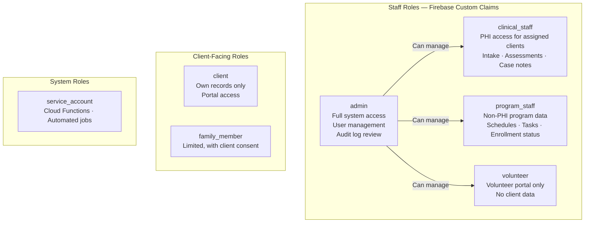

# Role-Based Access Control Design

HIPAA's minimum necessary standard requires that every person accessing PHI can only see what they need to do their job — nothing more. RBAC (Role-Based Access Control) is how you enforce this technically across Firebase Auth, Firestore Security Rules, and Cloud Functions.

---

## Role Definitions

For a nonprofit running reentry, housing, or social services programs:



---

## Role-to-Data Access Matrix

| Data Type | admin | clinical_staff | program_staff | volunteer | client |
|---|:---:|:---:|:---:|:---:|:---:|
| Client PHI (health, assessments) | ✅ All | ✅ Assigned only | ❌ | ❌ | ✅ Own only |
| Client demographics | ✅ All | ✅ Assigned only | ✅ Limited | ❌ | ✅ Own only |
| Program enrollment status | ✅ | ✅ | ✅ | ❌ | ✅ Own only |
| Case notes | ✅ | ✅ Assigned only | ❌ | ❌ | ✅ Own only |
| Staff schedules | ✅ | ✅ Own | ✅ Own | ✅ Own | ❌ |
| Volunteer records | ✅ | ❌ | ✅ | ✅ Own | ❌ |
| Donor data | ✅ | ❌ | ❌ | ❌ | ❌ |
| Audit logs | ✅ | ❌ | ❌ | ❌ | ❌ |
| System config | ✅ | ❌ | ❌ | ❌ | ❌ |

---

## Implementation: Firebase Auth Custom Claims

Roles are stored as custom claims on the Firebase user record. Claims are included in the ID token and available in Firestore Security Rules and Cloud Functions without an additional database query.

**Setting a role (Cloud Function — admin only):**
```javascript
const admin = require('firebase-admin');

exports.assignUserRole = functions.https.onCall(async (data, context) => {
  // Only admins can assign roles
  if (!context.auth?.token?.role === 'admin') {
    throw new functions.https.HttpsError('permission-denied', 'Admins only');
  }

  const { uid, role, assignedClients } = data;
  const validRoles = ['admin', 'clinical_staff', 'program_staff', 'volunteer', 'client'];

  if (!validRoles.includes(role)) {
    throw new functions.https.HttpsError('invalid-argument', `Invalid role: ${role}`);
  }

  const claims = { role };

  // Clinical staff get a list of client IDs they can access
  if (role === 'clinical_staff' && assignedClients?.length) {
    claims.assignedClients = assignedClients;
  }

  await admin.auth().setCustomUserClaims(uid, claims);

  // Log the role change (audit trail)
  await admin.firestore().collection('audit_logs').add({
    action:    'role_assigned',
    targetUid: uid,
    role:      role,
    assignedBy: context.auth.uid,
    timestamp: admin.firestore.FieldValue.serverTimestamp(),
  });

  return { success: true };
});
```

**Reading the role on the client:**
```javascript
import { getAuth } from 'firebase/auth';

async function getUserRole() {
  const user = getAuth().currentUser;
  if (!user) return null;

  // Force refresh to get latest claims
  const token = await user.getIdTokenResult(true);
  return token.claims.role;
}
```

---

## Implementation: Firestore Security Rules

Firestore Security Rules enforce access at the database layer — even if your Cloud Functions have a bug, the rules provide a safety net.

```javascript
rules_version = '2';
service cloud.firestore {
  match /databases/{database}/documents {

    // Helper functions
    function isAuthenticated() {
      return request.auth != null;
    }

    function hasRole(role) {
      return isAuthenticated() && request.auth.token.role == role;
    }

    function isAdmin() {
      return hasRole('admin');
    }

    function isClinicalStaff() {
      return hasRole('clinical_staff');
    }

    function isAssignedToClient(clientId) {
      return isClinicalStaff()
        && clientId in request.auth.token.get('assignedClients', []);
    }

    function isOwnRecord(userId) {
      return isAuthenticated() && request.auth.uid == userId;
    }

    // ── Deny all by default ──────────────────────────────────
    match /{document=**} {
      allow read, write: if false;
    }

    // ── Non-PHI: Program enrollment (no clinical data) ──────
    match /program_enrollment/{recordId} {
      allow read: if isAdmin()
        || isClinicalStaff()
        || (hasRole('program_staff'))
        || (hasRole('client') && resource.data.clientId == request.auth.uid);
      allow write: if isAdmin() || isClinicalStaff();
    }

    // ── Staff schedules ──────────────────────────────────────
    match /schedules/{scheduleId} {
      allow read: if isAuthenticated()
        && (isAdmin()
            || resource.data.staffId == request.auth.uid);
      allow write: if isAdmin();
    }

    // ── Volunteer records (no PHI) ───────────────────────────
    match /volunteers/{volunteerId} {
      allow read: if isAdmin()
        || (hasRole('program_staff'))
        || (hasRole('volunteer') && volunteerId == request.auth.uid);
      allow write: if isAdmin() || hasRole('program_staff');
    }

    // ── Audit logs — read admin only, write Functions only ───
    match /audit_logs/{logId} {
      allow read: if isAdmin();
      allow write: if false; // Cloud Functions only via Admin SDK
    }

    // ── NOTE: PHI (client health records) lives in Cloud SQL ─
    // ── Not in Firestore. Cloud Functions mediate all PHI access.
  }
}
```

---

## Implementation: Cloud Function Access Control

Every Cloud Function that touches PHI should follow this pattern:

```javascript
async function validatePhiAccess(context, clientId) {
  // 1. Must be authenticated
  if (!context.auth) {
    throw new functions.https.HttpsError('unauthenticated', 'Login required');
  }

  const { role, uid } = context.auth.token;

  // 2. Must have a PHI-eligible role
  if (!['admin', 'clinical_staff'].includes(role)) {
    throw new functions.https.HttpsError('permission-denied',
      `Role '${role}' cannot access PHI`);
  }

  // 3. Clinical staff can only access assigned clients
  if (role === 'clinical_staff') {
    const assignedClients = context.auth.token.assignedClients || [];
    if (!assignedClients.includes(clientId)) {
      throw new functions.https.HttpsError('permission-denied',
        'Not assigned to this client');
    }
  }

  // 4. Return validated identity for audit logging
  return { uid, role };
}

// Usage in any PHI-accessing function:
exports.getClientRecord = functions.https.onCall(async (data, context) => {
  const { uid, role } = await validatePhiAccess(context, data.clientId);

  const record = await queryClientFromSQL(data.clientId);

  // Audit log every PHI access
  await logPhiAccess({
    action:   'read_client_record',
    clientId: data.clientId,
    accessedBy: uid,
    role,
  });

  return record;
});
```

---

## MFA Enforcement by Role

```javascript
// Enforce MFA on login for clinical and admin roles
export async function enforceRoleMfa(user, role) {
  const mfaEnrolled = user.multiFactor?.enrolledFactors?.length > 0;
  const mfaRequired = ['admin', 'clinical_staff'].includes(role);

  if (mfaRequired && !mfaEnrolled) {
    // Sign out and redirect to MFA enrollment
    await getAuth().signOut();
    router.push('/setup-mfa?required=true&role=' + role);
    return false;
  }
  return true;
}
```

---

**Next:** [Data Classification →](06-data-classification.md)
