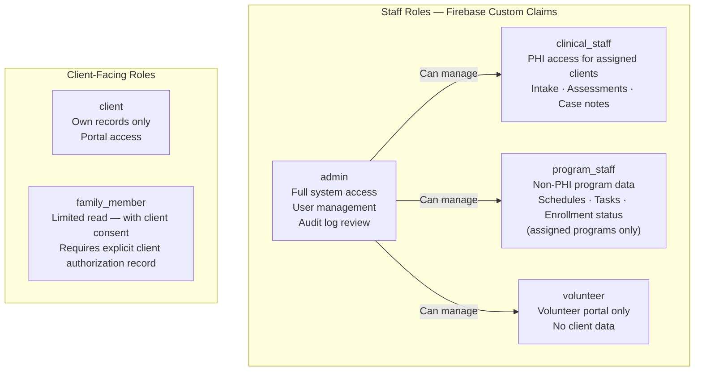

# Role-Based Access Control Design

HIPAA's minimum necessary standard requires that every person accessing PHI can only see what they need to do their job — nothing more. RBAC (Role-Based Access Control) is how you enforce this technically across Firebase Auth, Firestore Security Rules, and Cloud Functions.

 

## Role Definitions

For a nonprofit running reentry, housing, or social services programs:


```mermaid
flowchart TD
    subgraph Roles["Staff Roles — Firebase Custom Claims"]
        ADM["admin\nFull system access\nUser management\nAudit log review"]
        CS["clinical_staff\nPHI access for assigned clients\nIntake · Assessments · Case notes"]
        PS["program_staff\nNon-PHI program data\nSchedules · Tasks · Enrollment status\n(assigned programs only)"]
        VOL["volunteer\nVolunteer portal only\nNo client data"]
    end

    subgraph Client["Client-Facing Roles"]
        CLI["client\nOwn records only\nPortal access"]
        FAM["family_member\nLimited read — with client consent\nRequires explicit client authorization record"]
    end

    ADM -->|"Can manage"| CS
    ADM -->|"Can manage"| PS
    ADM -->|"Can manage"| VOL
```

> **Note on service accounts:** Cloud Functions access Layer 3 (Cloud SQL, Cloud Storage) using GCP IAM service accounts — not Firebase custom claims. Service account permissions are governed at the GCP IAM level, separate from this RBAC model.

> **Note on `family_member`:** This role is defined for future implementation. It requires a client-signed authorization record before any access is granted. It must not be assigned until the authorization workflow is implemented and the Firestore rules below are extended to enforce it.

 

## Role-to-Data Access Matrix

| Data Type | admin | clinical_staff | program_staff | volunteer | client |
| |:---:|:---:|:---:|:---:|:---:|
| Client PHI (health, assessments) | ✅ All | ✅ Assigned only | ❌ | ❌ | ✅ Own only |
| Client demographics | ✅ All | ✅ Assigned only | ✅ Limited | ❌ | ✅ Own only |
| Program enrollment status | ✅ | ✅ | ✅ Assigned programs only | ❌ | ✅ Own only |
| Case notes | ✅ | ✅ Assigned only | ❌ | ❌ | ✅ Own only |
| Staff schedules | ✅ | ✅ Own | ✅ Own | ✅ Own | ❌ |
| Volunteer records | ✅ | ❌ | ✅ | ✅ Own | ❌ |
| Donor data | ✅ | ❌ | ❌ | ❌ | ❌ |
| Audit logs | ✅ | ❌ | ❌ | ❌ | ❌ |
| System config | ✅ | ❌ | ❌ | ❌ | ❌ |

 

## Implementation: Firebase Auth Custom Claims

Roles are stored as custom claims on the Firebase user record. Claims are included in the ID token and available in Firestore Security Rules and Cloud Functions without an additional database query.

> **JWT size limit:** Firebase custom claims are limited to 1000 bytes. Do not store `assignedClients` arrays in the JWT — this will silently fail for staff assigned to more than ~30 clients. Client-staff assignments are stored in a Firestore `staff_assignments` collection and validated server-side in Cloud Functions.

**Assigning a role (Cloud Function — admin only):**

```javascript
const admin = require('firebase-admin');

exports.assignUserRole = functions.https.onCall(async (data, context) => {
  // Step 1: Verify the caller is authenticated
  if (!context.auth) {
    throw new functions.https.HttpsError('unauthenticated', 'Login required');
  }

  // Step 2: Verify the caller has the admin role
  // NOTE: Do NOT write this as: !context.auth?.token?.role === 'admin'
  // That expression is always false due to operator precedence. It is a no-op.
  if (context.auth.token.role !== 'admin') {
    throw new functions.https.HttpsError('permission-denied', 'Admins only');
  }

  const { uid, role } = data;
  const validRoles = ['admin', 'clinical_staff', 'program_staff', 'volunteer', 'client'];

  if (!uid || typeof uid !== 'string') {
    throw new functions.https.HttpsError('invalid-argument', 'uid is required');
  }

  if (!validRoles.includes(role)) {
    throw new functions.https.HttpsError('invalid-argument', `Invalid role: ${role}`);
  }

  // Capture the previous role before overwriting for the audit record
  const existingUser = await admin.auth().getUser(uid);
  const previousRole = existingUser.customClaims?.role ?? null;

  // Set the new role — only the role claim; assignments are managed separately
  await admin.auth().setCustomUserClaims(uid, { role });

  // Revoke existing tokens immediately so the role change takes effect now,
  // not when the user's current token expires (up to 1 hour later)
  await admin.auth().revokeRefreshTokens(uid);

  // Audit log: record who changed what, from what, to what
  await admin.firestore().collection('audit_logs').add({
    action:       'role_assigned',
    targetUid:    uid,
    previousRole: previousRole,
    newRole:      role,
    assignedBy:   context.auth.uid,
    timestamp:    admin.firestore.FieldValue.serverTimestamp(),
  });

  return { success: true };
});
```

**Revoking access at termination (Cloud Function — admin only):**

```javascript
exports.revokeUserAccess = functions.https.onCall(async (data, context) => {
  if (!context.auth) {
    throw new functions.https.HttpsError('unauthenticated', 'Login required');
  }
  if (context.auth.token.role !== 'admin') {
    throw new functions.https.HttpsError('permission-denied', 'Admins only');
  }

  const { uid } = data;
  if (!uid || typeof uid !== 'string') {
    throw new functions.https.HttpsError('invalid-argument', 'uid is required');
  }

  const existingUser = await admin.auth().getUser(uid);
  const previousRole = existingUser.customClaims?.role ?? null;

  // Disable the account and clear all claims
  await admin.auth().updateUser(uid, { disabled: true });
  await admin.auth().setCustomUserClaims(uid, {});
  await admin.auth().revokeRefreshTokens(uid);

  // Remove any staff assignments from Firestore
  const assignmentSnap = await admin.firestore()
    .collection('staff_assignments')
    .where('staffId', '==', uid)
    .get();

  const batch = admin.firestore().batch();
  assignmentSnap.forEach(doc => batch.delete(doc.ref));
  await batch.commit();

  await admin.firestore().collection('audit_logs').add({
    action:       'access_revoked',
    targetUid:    uid,
    previousRole: previousRole,
    revokedBy:    context.auth.uid,
    timestamp:    admin.firestore.FieldValue.serverTimestamp(),
  });

  return { success: true };
});
```

**Reading the role on the client:**

```javascript
import { getAuth } from 'firebase/auth';

async function getUserRole() {
  const user = getAuth().currentUser;
  if (!user) return null;

  // Force refresh to get latest claims after any server-side role change
  const token = await user.getIdTokenResult(true);
  return token.claims.role;
}
```

 

## Implementation: Firestore Security Rules

Firestore Security Rules enforce access at the database layer — a defense-in-depth measure even if Cloud Function logic contains an error.

```javascript
rules_version = '2';
service cloud.firestore {
  match /databases/{database}/documents {

    // ── Helper functions ─────────────────────────────────────

    function isAuthenticated() {
      return request.auth != null;
    }

    function hasRole(role) {
      return isAuthenticated() && request.auth.token.role == role;
    }

    function isAdmin() {
      return hasRole('admin');
    }

    function isClinicalStaff() {
      return hasRole('clinical_staff');
    }

    // Client-staff assignment is validated via Firestore, not JWT claims,
    // to avoid the 1000-byte JWT size limit
    function isAssignedToClient(clientId) {
      return isClinicalStaff()
        && exists(/databases/$(database)/documents/staff_assignments/$(request.auth.uid + '_' + clientId));
    }

    // Program staff assignment — staff may only access programs they manage
    function isAssignedToProgram(programId) {
      return hasRole('program_staff')
        && exists(/databases/$(database)/documents/program_assignments/$(request.auth.uid + '_' + programId));
    }

    function isOwnRecord(userId) {
      return isAuthenticated() && request.auth.uid == userId;
    }

    // ── Deny all by default ──────────────────────────────────
    match /{document=**} {
      allow read, write: if false;
    }

    // ── Non-PHI: Program enrollment (no clinical data) ──────
    // program_staff access is scoped to assigned programs only (minimum necessary)
    match /program_enrollment/{recordId} {
      allow read: if isAdmin()
        || isClinicalStaff()
        || isAssignedToProgram(resource.data.programId)
        || (hasRole('client') && resource.data.clientId == request.auth.uid);
      allow create, update: if isAdmin() || isClinicalStaff();
      allow delete: if isAdmin();
    }

    // ── Staff assignments (clinical) ─────────────────────────
    match /staff_assignments/{assignmentId} {
      allow read: if isAdmin()
        || (isClinicalStaff() && resource.data.staffId == request.auth.uid);
      allow create, update, delete: if isAdmin();
    }

    // ── Program assignments (program staff) ──────────────────
    match /program_assignments/{assignmentId} {
      allow read: if isAdmin()
        || (hasRole('program_staff') && resource.data.staffId == request.auth.uid);
      allow create, update, delete: if isAdmin();
    }

    // ── Staff schedules ──────────────────────────────────────
    match /schedules/{scheduleId} {
      allow read: if isAuthenticated()
        && (isAdmin() || resource.data.staffId == request.auth.uid);
      allow create, update: if isAdmin();
      allow delete: if isAdmin();
    }

    // ── Volunteer records (no PHI) ───────────────────────────
    match /volunteers/{volunteerId} {
      allow read: if isAdmin()
        || hasRole('program_staff')
        || (hasRole('volunteer') && volunteerId == request.auth.uid);
      allow create, update: if isAdmin() || hasRole('program_staff');
      allow delete: if isAdmin();
    }

    // ── Audit logs — read admin only, write Cloud Functions only ─
    match /audit_logs/{logId} {
      allow read: if isAdmin();
      allow write: if false; // Written exclusively via Admin SDK in Cloud Functions
    }

    // ── NOTE: PHI (client health records) lives in Cloud SQL ─
    // ── Not in Firestore. Cloud Functions mediate all PHI access.
  }
}
```

 

## Implementation: Cloud Function PHI Access Control

Every Cloud Function that touches PHI must follow this validation pattern. The steps must execute in order — no data operation may occur before all validations pass.

```javascript
const admin = require('firebase-admin');
const functions = require('firebase-functions');

// Reusable validator — call this at the top of every PHI-touching function
async function validatePhiAccess(context, clientId) {
  // 1. Must be authenticated
  if (!context.auth) {
    throw new functions.https.HttpsError('unauthenticated', 'Login required');
  }

  const { role, uid } = context.auth.token;

  // 2. Verify MFA is enrolled for roles that require it (server-side check)
  if (['admin', 'clinical_staff'].includes(role)) {
    const user = await admin.auth().getUser(uid);
    if (!user.multiFactor?.enrolledFactors?.length) {
      throw new functions.https.HttpsError(
        'failed-precondition',
        'MFA enrollment required for this role'
      );
    }
  }

  // 3. Must have a PHI-eligible role
  if (!['admin', 'clinical_staff'].includes(role)) {
    throw new functions.https.HttpsError('permission-denied',
      `Role '${role}' cannot access PHI`);
  }

  // 4. Validate clientId format before using it in any query
  if (!clientId || typeof clientId !== 'string' || clientId.trim().length === 0) {
    throw new functions.https.HttpsError('invalid-argument', 'Valid clientId is required');
  }

  // 5. Clinical staff may only access assigned clients
  //    Assignment is validated against Firestore, not JWT claims
  if (role === 'clinical_staff') {
    const assignmentId = `${uid}_${clientId}`;
    const assignment = await admin.firestore()
      .collection('staff_assignments')
      .doc(assignmentId)
      .get();

    if (!assignment.exists) {
      throw new functions.https.HttpsError('permission-denied',
        'Not assigned to this client');
    }
  }

  // Return validated identity for downstream audit logging
  return { uid, role };
}

// Audit logger — call after every PHI access, never include PHI field values
async function logPhiAccess({ action, clientId, accessedBy, role }) {
  await admin.firestore().collection('audit_logs').add({
    action,
    clientId,
    accessedBy,
    role,
    timestamp: admin.firestore.FieldValue.serverTimestamp(),
  });
}

// Example: retrieving a client record
exports.getClientRecord = functions.https.onCall(async (data, context) => {
  const { uid, role } = await validatePhiAccess(context, data.clientId);

  const record = await queryClientFromSQL(data.clientId);

  await logPhiAccess({
    action:     'read_client_record',
    clientId:   data.clientId,
    accessedBy: uid,
    role,
  });

  return record;
});
```

 

## MFA Enforcement by Role

MFA enforcement must be validated **server-side** inside `validatePhiAccess` (shown above). Client-side redirection to an enrollment page is a UX convenience only — it is bypassable by any caller that invokes the Cloud Function directly without going through the client application.

```javascript
// Client-side MFA check — UX only, not a security control
export async function enforceRoleMfa(user, role) {
  const mfaEnrolled = user.multiFactor?.enrolledFactors?.length > 0;
  const mfaRequired = ['admin', 'clinical_staff'].includes(role);

  if (mfaRequired && !mfaEnrolled) {
    await getAuth().signOut();
    router.push('/setup-mfa?required=true&role=' + role);
    return false;
  }
  return true;
}
```

The server-side MFA check in `validatePhiAccess` is the authoritative enforcement point. The client-side check above improves user experience by surfacing the enrollment requirement early — it is not a substitute for server-side validation.

 

## Staff Assignment Management

Client-staff assignments are stored in Firestore under `staff_assignments/{staffId}_{clientId}`. This replaces the previous pattern of embedding an `assignedClients` array in the Firebase Auth custom claims JWT, which has a hard 1000-byte size limit that causes silent failures at scale.

**Adding a client assignment:**

```javascript
exports.assignClientToStaff = functions.https.onCall(async (data, context) => {
  if (!context.auth) {
    throw new functions.https.HttpsError('unauthenticated', 'Login required');
  }
  if (context.auth.token.role !== 'admin') {
    throw new functions.https.HttpsError('permission-denied', 'Admins only');
  }

  const { staffId, clientId } = data;
  if (!staffId || !clientId) {
    throw new functions.https.HttpsError('invalid-argument', 'staffId and clientId are required');
  }

  const assignmentId = `${staffId}_${clientId}`;
  await admin.firestore().collection('staff_assignments').doc(assignmentId).set({
    staffId,
    clientId,
    assignedBy: context.auth.uid,
    assignedAt: admin.firestore.FieldValue.serverTimestamp(),
  });

  await admin.firestore().collection('audit_logs').add({
    action:     'client_assigned',
    staffId,
    clientId,
    assignedBy: context.auth.uid,
    timestamp:  admin.firestore.FieldValue.serverTimestamp(),
  });

  return { success: true };
});
```

 

**Next:** [Data Classification →](06-data-classification.md)
