# Data Classification

Knowing what counts as PHI in your system determines your entire security architecture. This page classifies common data types for nonprofit social services organizations and maps each to the correct storage layer.

---

## Classification Tiers

| Tier | Definition | Storage | BAA Required |
|---|---|---|---|
| **PHI** | Health information linkable to an individual | Cloud SQL / Cloud Storage (Layer 3) | Yes |
| **Sensitive Non-PHI** | Personally identifiable but not health data | Firestore (Layer 2) | Recommended |
| **Operational** | Program and org data with no PII | Firestore (Layer 2) | No |
| **Public** | Non-sensitive content | WordPress / Firestore | No |

---

## PHI — Stored in Cloud SQL / Cloud Storage Only

These fields constitute PHI for a social services or reentry nonprofit. They must live in Layer 3 and be accessed only through authenticated Cloud Functions.

### Health & Clinical Data
- Physical health diagnoses, medical conditions, disabilities
- Mental health diagnoses (depression, PTSD, schizophrenia, etc.)
- Substance use disorder history, current status, treatment
- Medications (name, dosage, prescribing provider)
- Pregnancy status, reproductive health information
- HIV/AIDS status
- Clinical assessments and screening scores (PHQ-9, AUDIT-C, ACES score, etc.)
- Therapy and counseling notes
- Psychiatric evaluations

### Criminal Justice Records (when collected for services)
- Prior convictions, charges, case numbers
- Parole/probation officer contact and conditions
- Incarceration history (facility, dates, release conditions)
- Court dates, pending charges
- Sex offender registry status

### Children & Family Data
- Minor children's names, ages, custody status
- Child welfare case involvement (DCFS, CPS records)
- School records when part of a service plan
- Foster care history

### Financial Data (when linked to services)
- Income level and sources when tied to eligibility determination
- Benefits received (Medicaid, SNAP, SSI) when part of a service record
- Debt and financial hardship details in case notes

### Identifiers that Make Other Data PHI
Any of the above becomes PHI when combined with:
- Full name
- Date of birth
- Social Security Number
- Address (full street address)
- Phone number or email, when in the same record as health data
- Photos when tied to a service record

---

## Sensitive Non-PHI — Stored in Firestore (Layer 2)

This data is personally identifiable but not clinical health information. It requires security controls but not the same strict PHI handling.

- First name + last name (without health data attached)
- Contact information (phone, email) in the volunteer/donor context
- Staff employment records, performance data
- Volunteer background check status (pass/fail — not the full report)
- Donor giving history and contact preferences
- Organizational financial data

---

## Operational Data — Stored in Firestore (Layer 2)

No PII attached. Safe to store in Firestore without HIPAA-specific controls, though general security best practices still apply.

- Program enrollment counts (de-identified)
- Schedule slots and availability windows
- Task assignments (staff ID + task ID — no client data in the task record)
- System notifications and alerts
- Aggregate reporting metrics
- Internal documentation and SOPs
- Event logs referencing IDs only (no PHI field values)

---

## Data Classification Decision Tree

```mermaid
flowchart TD
    Q1{"Does this data describe\na person's health, mental health,\nsubstance use, or disability?"}
    Q2{"Can this data be linked\nto a specific named individual?"}
    Q3{"Is this data about a specific\nindividual's involvement in\ncriminal justice or child welfare\nas part of services?"}
    Q4{"Does this data contain\ndirect identifiers (name, DOB,\nSSN, address)?"}

    PHI["🔴 PHI\nStore in Cloud SQL\nCloud Function access only\nBAA required"]
    SNPHI["🟡 Sensitive Non-PHI\nStore in Firestore\nSecurity rules required\nBAA recommended"]
    OPS["🟢 Operational\nStore in Firestore\nStandard security controls"]

    Q1 -->|Yes| Q2
    Q1 -->|No| Q3
    Q2 -->|Yes| PHI
    Q2 -->|No| SNPHI
    Q3 -->|Yes| Q2
    Q3 -->|No| Q4
    Q4 -->|Yes| SNPHI
    Q4 -->|No| OPS
```



---

## Firestore Document Schema Examples

**✅ Correct — Firestore enrollment record (no PHI)**
```json
{
  "clientId": "client_abc123",
  "programId": "reentry_housing",
  "enrolledAt": "2024-03-15T10:00:00Z",
  "enrolledBy": "staff_xyz789",
  "status": "active",
  "nextCheckIn": "2024-03-29"
}
```

No health data. No diagnosis. No criminal history. Just program logistics. This is safe in Firestore.

**❌ Wrong — PHI mixed into Firestore**
```json
{
  "clientId": "client_abc123",
  "programId": "reentry_housing",
  "diagnosis": "Major Depressive Disorder",
  "medications": ["Sertraline 50mg"],
  "priorConvictions": ["assault", "drug possession"],
  "enrolledAt": "2024-03-15T10:00:00Z"
}
```

`diagnosis`, `medications`, and `priorConvictions` are PHI. This document should not be in Firestore — that data belongs in Cloud SQL.

---

## Data Retention and Deletion

HIPAA doesn't mandate a specific retention period, but many state laws and program requirements do. Design your system to support:

- **Retention policies:** Cloud SQL and Cloud Storage lifecycle rules to auto-delete records after a defined period
- **Right to access:** Clients can request their records — your Cloud Functions should support this query
- **Deletion requests:** Staff can mark records for deletion — implement soft-delete first, hard-delete on schedule
- **Audit trail preservation:** Audit logs must be retained even when the underlying PHI is deleted

```sql
-- Example: flag records for deletion after retention period
UPDATE clients
SET deletion_scheduled = TRUE,
    deletion_date = DATEADD(year, 7, created_at)
WHERE program_exit_date < DATEADD(year, 7, NOW());
```

---

**Next:** [Nonprofit Cost Guide →](07-nonprofit-cost-guide.md)
